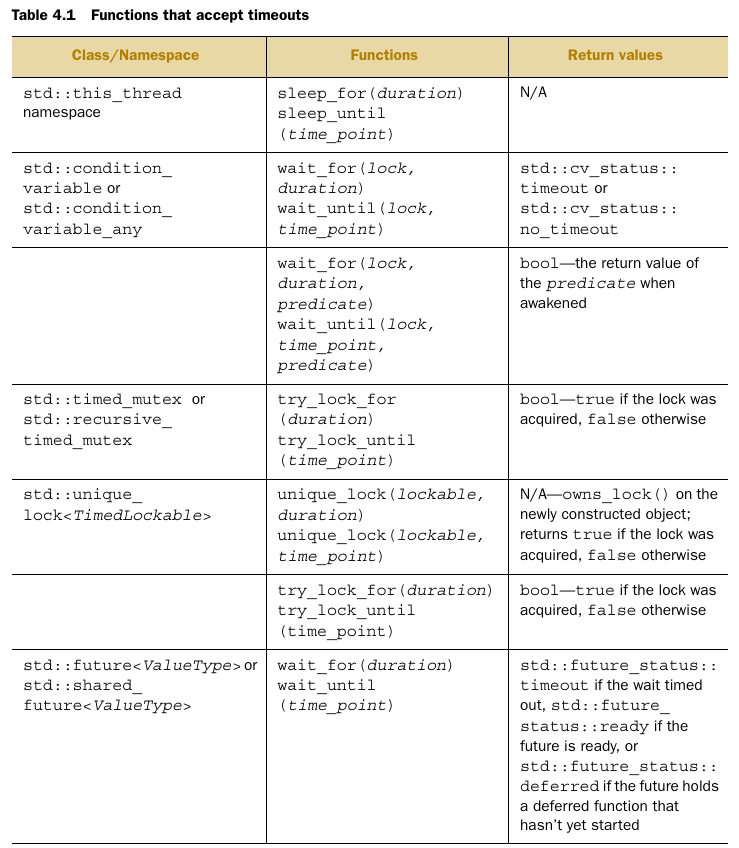

# C++ Concurrency in Action

## Useful Videos 

[std::lock](https://www.youtube.com/watch?v=ruYGFYTRbe8)

[std::unique_lock](https://www.youtube.com/watch?v=IBu5ka1MQ7w)

[Recursive mutex std::recursive_mutex](https://www.youtube.com/watch?v=yCYU2k77E4A)

[Condition variable](https://www.youtube.com/watch?v=eh_9zUNmTig)

[std::promise And std::future ](https://www.youtube.com/watch?v=XDZkyQVsbDY)

[std::async](https://www.youtube.com/watch?v=eTMY5zXits8)

[packaged_task](https://www.youtube.com/watch?v=FfbZfBk-3rI&list=PL5jc9xFGsL8E12so1wlMS0r0hTQoJL74M&index=9)

[future, Promise and async](https://www.youtube.com/watch?v=SZQ6-pf-5Us)

## Useful Articles

## Others

### Functions that accept timeouts

