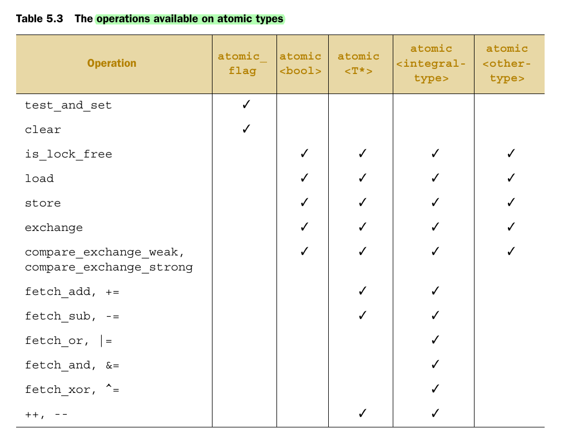
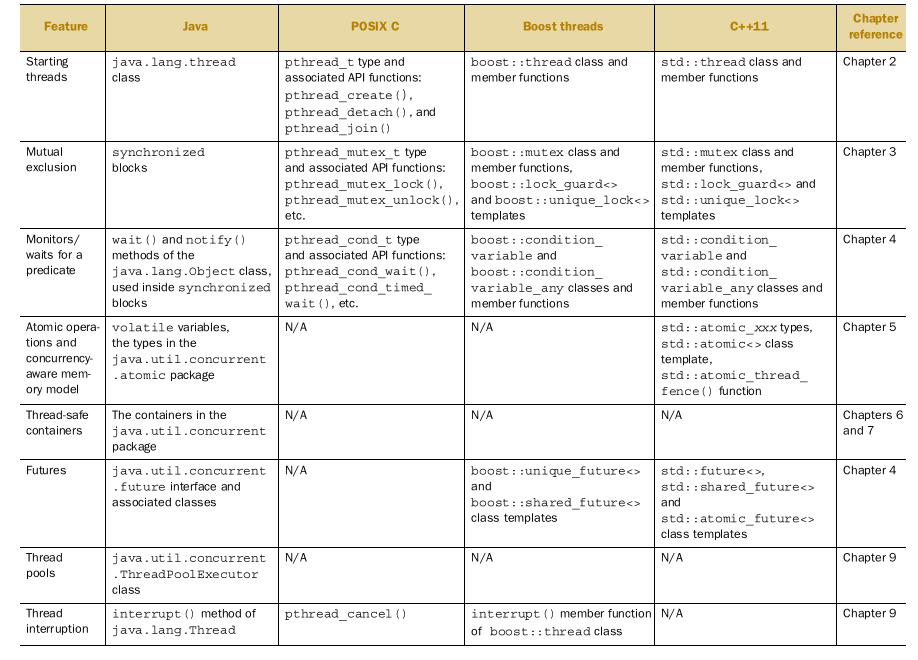

# C++ Concurrency in Action

## Useful Videos 

[std::lock](https://www.youtube.com/watch?v=ruYGFYTRbe8)

[std::unique_lock](https://www.youtube.com/watch?v=IBu5ka1MQ7w)

[Recursive mutex std::recursive_mutex](https://www.youtube.com/watch?v=yCYU2k77E4A)

[Condition variable](https://www.youtube.com/watch?v=eh_9zUNmTig)

[std::promise And std::future ](https://www.youtube.com/watch?v=XDZkyQVsbDY)

[std::async](https://www.youtube.com/watch?v=eTMY5zXits8)

[packaged_task](https://www.youtube.com/watch?v=FfbZfBk-3rI&list=PL5jc9xFGsL8E12so1wlMS0r0hTQoJL74M&index=9)

[future, Promise and async](https://www.youtube.com/watch?v=SZQ6-pf-5Us)

**[Atomic Variables and Memory Models](https://www.youtube.com/watch?v=IE6EpkT7cJ4)**

[Intro to atomic variable](https://www.youtube.com/watch?v=oE_D3IgBJi8)

[CppCon 2017 : C++ atomics, from basic to advanced. What do they really do?](https://www.youtube.com/watch?v=ZQFzMfHIxng&t=0s)

[C++ and Beyond 2012: Herb Sutter - atomic<> Weapons, 1 of 2](https://channel9.msdn.com/Shows/Going+Deep/Cpp-and-Beyond-2012-Herb-Sutter-atomic-Weapons-1-of-2)

[C++ and Beyond 2012: Herb Sutter - atomic<> Weapons, 2 of 2](https://channel9.msdn.com/Shows/Going+Deep/Cpp-and-Beyond-2012-Herb-Sutter-atomic-Weapons-2-of-2)

## Useful Articles

[Understanding C++ Atomic Operations](https://sdjournal.org/understanding-c-atomic-operations/)

[GCC Wiki : Memory model synchronization modes](http://gcc.gnu.org/wiki/Atomic/GCCMM/AtomicSync)

[The C++11 Memory Model and GCC](https://gcc.gnu.org/wiki/Atomic/GCCMM)

[Fine-graoned synchronization & lock-free programming lecture slide](http://www.cs.cmu.edu/~418/lectures/18_lockfree.pdf)

[C++ Core Guidelines](https://github.com/isocpp/CppCoreGuidelines)

[Initialize member variables](https://visualstudiomagazine.com/articles/2016/05/01/initialize-member-variables.aspx)

[Thread local data](https://www.modernescpp.com/index.php/thread-local-data)

[C++11 : How to Stop or Terminate a Thread](https://thispointer.com/c11-how-to-stop-or-terminate-a-thread/)

### Functions that accept timeouts

### The operations available on atomic types

## Brief comparison of concurrency libraries

### Compiler Explorer

[C++ code to CPU instructions ](https://godbolt.org/)